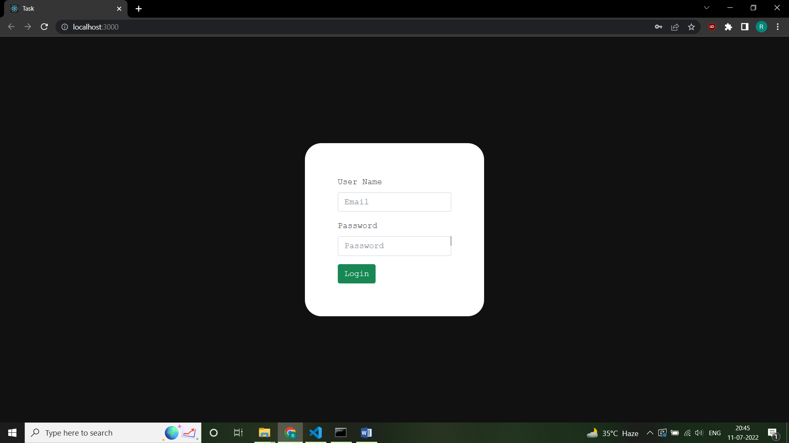
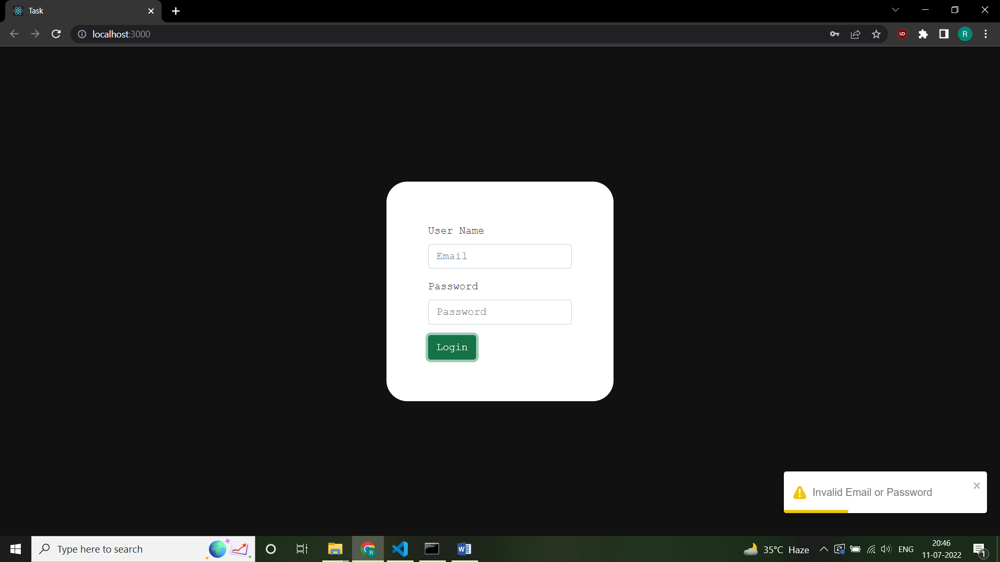
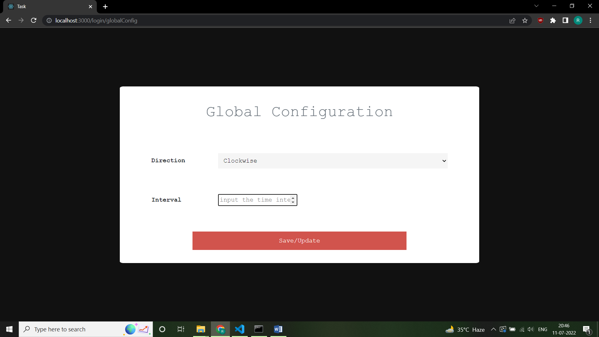
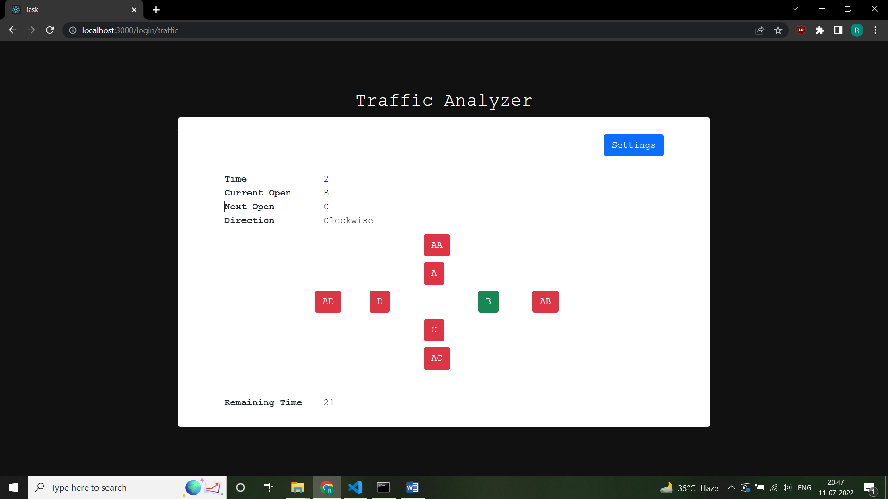

## ABOUT

Used node for backend and reactjs for frontend and mysql server for storing data of user

#### Add Two Users:

a) root-> 1234
b) rishi-> 5678

When you run this code after cloning both the frontend and backend repository
first create the database task in your local sql server and then add two users in the
login table, rishi and root with the above password. So, that when you login validation/authorization occurs successfully or else you won't be able to get redirected to the globalConfig because initially in your local system task database will not be present and hence authorization doesn't occurs successfully.

## NOTE:

Keep in mind create the create a user root in your database with the following
properties or edit it depending on your mysql server:

```
const db = mysql.createConnection({
  user: "root",
  host: "localhost",
  password: "root@123",
  database: "task",
});
```

## Screenshots









