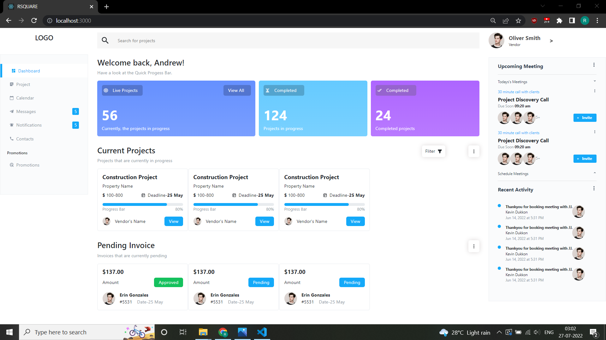
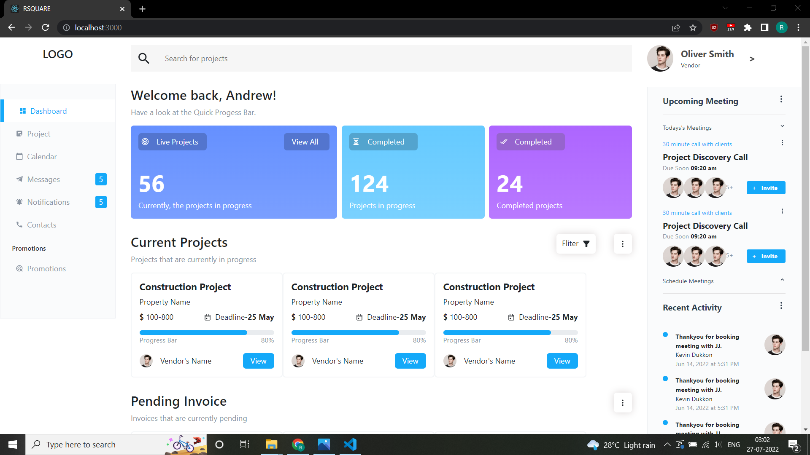
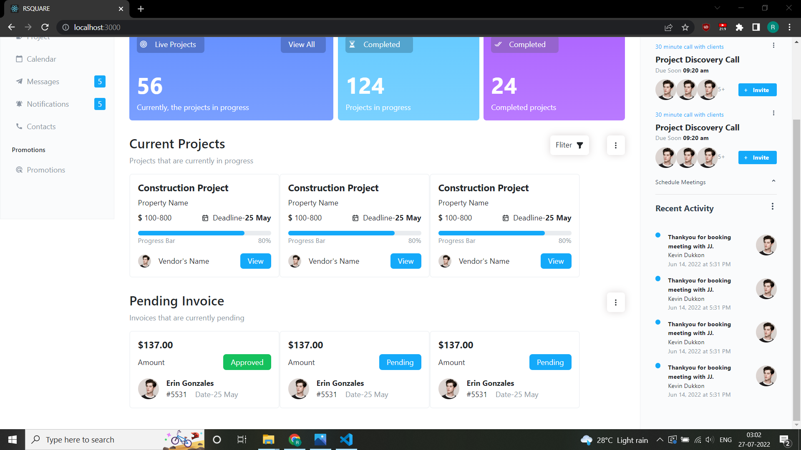

# About

Designed the whole template in React from scratch without using any external library like
Bootstrap etc.(For structuring the whole content used FlexBox only)

## Live URL

```
https://rishi0777.github.io/Assessments/
```

## How to run

1. Just clone repository or download the zipped file.
2. Open the folder and write this command to install all dependencies specified in package.json file

```
npm install
```

3. Write this command to run

```
npm start
```

## Deployed on Github Pages

```
npm i gh-pages
```

```
npm run deploy
```

## Screenshots






